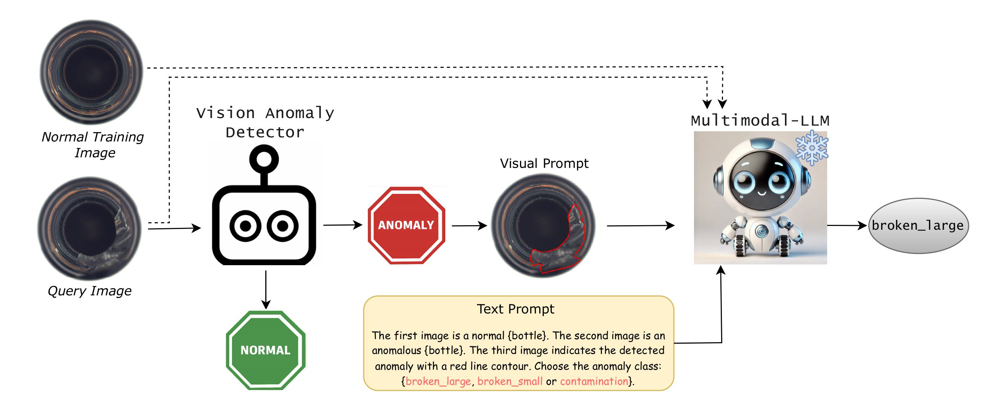

# VELM (Vision Expert + Language Model): A framework for Anomaly Classification (AC)

Repository provides the source code for the paper "Detect, Classify, Act: Categorizing Industrial Anomalies with Multi-Modal Large Language Models":

### [arXiv](https://arxiv.org/abs/2505.02626)

 

## Overview

The project supports multiple LLM backends including GPT-4o, GPT-4o-mini, and Qwen2-VL. VELM enables anomaly classification by leveraging the visual understanding capabilities of multimodal LLMs. The system can:

- Process images of industrial objects
- Detect and localize anomalies using a vision expert
- Generate red line contour based on anomaly localization
- Classify different types of anomaly 
- Distinguish between negligible anomalies and critical defects
- Evaluate model performance using various metrics

## Repository Structure

```
VELM/
├── configs/                  # Configuration files
│   ├── prompts/              # Preprocessed prompts for different datasets
│   ├── predictions/          # Model predictions
|   ├── evaluations/          # Evaluation results
│   ├── mvtec_ad_des.json     # MVTec-AD dataset descriptions
│   ├── mvtec_ac_des.json     # MVTec-AC dataset descriptions
│   └── visa_ac_des.json      # VisA-AC dataset descriptions
├── datasets/                 # Datasets (download links are provided)
│   ├── mvtec_ad              # MVTec-AD dataset
│   ├── mvtec_ac              # MVTec-AC dataset
│   └── visa_ac               # VisA-AC dataset
├── utils.py                  # Common utility functions
├── ddad_reorganizer.py       # Match the output of DDAD to the expected directory structure
├── create_contour.py         # Script to draw contour lines on the query image based on detected anomalies
├── generate_prompts.py       # Script to preprocess prompts
├── run_llm_hm.py             # Script to run LLM models with heatmap visualization
├── eval.py                   # Script to evaluate model predictions
└── anomaly_vs_defect.py      # Script to evaluate negligible anomaly vs. critical defect classification
```

## Installation

1. Clone the repository:
```bash
git clone https://github.com/Sassanmtr/VELM.git
cd VELM
```

2. Install dependencies:
```bash
conda create --name velm_env python=3.9
conda activate velm_env
pip install -r requirements.txt
```

3. (For experiments with GPT) Set up environment variables:
Create a `.env` file in the root directory with your API keys:
```
OPENAI_API_KEY=your_openai_api_key
```

## Datasets

The framework supports the following datasets:

- **MVTec-AD**: A dataset for unsupervised anomaly detection
- **MVTec-AC**: A dataset for anomaly classification
- **VisA-AC**: A dataset for anomaly classification

### Download and Setup Instructions

- [MVTec-AD](https://www.mvtec.com/company/research/datasets/mvtec-ad) Download and place in the `datasets/mvtec_ad` folder  
- [MVTec-AC](https://drive.google.com/drive/folders/1R_rZgZbHEF9byic84zdlWezECtmUk4na?usp=sharing) Download and place in the `datasets/mvtec_ac` folder

**Note:** MVTec-AC uses the same training set as MVTec-AD. You can copy the train folder from mvtec_ad to mvtec_ac if needed


- [VisA-AC](https://drive.google.com/drive/folders/1cpF_yJD0cOIQoyx1egf1V4sGfvMpLTLn?usp=sharing) Download and place in the `datasets/visa_ac` folder

 **Note:** VisA-AC uses the same training set as VisA. If VisA is already downloaded, you can reuse its train folder.
 

## Usage

### Create Contour Images
Generate red contour lines from heatmaps to overlay on test images:

```bash
python create_contour.py --dataset mvtec_ac --image_size 448
```
Options:
- `--config`: Path to YAML configuration file (default: `configs/contour_config.yaml`)
- `--dataset`: Dataset to use (mvtec_ad, mvtec_ac, visa_ac)-overrides config
- `image_size`: Resize inout images and heatmaps to this size (default: 448)

**Note:** To use heatmaps generated by other methods, update the `heatmap_dir` path in the configuration file accordingly

### Generating Prompts

Generate prompts for the LLM to perform anomaly classification:

```bash
python generate_prompts.py --dataset mvtec_ac --text_type conditioned --ddad_format True
```

Options:
- `--dataset`: Dataset to use (mvtec_ad, mvtec_ac, visa_ac)
- `--text_type`: Type of text to generate (raw: reference and query images, conditioned: reference, contour, and query images)
- `--ddad_format`: Whether to use DDAD format (True/False)

### Running LLM Models

Run LLM models for anomaly detection with heatmap visualization:

```bash
# Using GPT-4o (default)
python run_llm.py --model gpt --dataset mvtec_ad --heatmap_mode contour

# Using GPT-4o-mini
python run_llm.py --model gpt --gpt_model gpt-4o-mini --dataset mvtec_ad --heatmap_mode contour

# Using Qwen2-VL
python run_llm.py --model qwen --dataset mvtec_ac --heatmap_mode contour
```

Options:
- `--model`: Model to use (gpt, qwen)
- `--gpt_model`: GPT model to use (gpt-4o, gpt-4o-mini) - only applicable if model=gpt
- `--dataset`: Dataset to use (mvtec_ad, mvtec_ac, visa_ac)
- `--heatmap_mode`: Heatmap visualization mode (contour, none)
- `--image_size`: Size to resize images to (default: 448)
- `--num_ref`: Number of reference images to use (default: 1)

### Evaluating Model Performance

Evaluate model predictions:

```bash
python eval.py --dataset mvtec_ad --model gpt-4o --heatmap_mode contour
```

Options:
- `--dataset`: Dataset to evaluate (mvtec_ad, mvtec_ac, visa_ac)
- `--model`: Model type used for predictions (gpt-4o, gpt-4o-mini, qwen)
- `--heatmap_mode`: Heatmap visualization mode (contour, none)
- `--output`: Path to save evaluation results (optional)
- `--verbose`: Enable verbose logging

### Anomaly vs. Defect Classification

Evaluate model performance in distinguishing between critical defects and negligible anomalies:

```bash
python anomaly_vs_defect.py --dataset mvtec_ad --model gpt-4o --heatmap_mode contour
```

Options:
- `--dataset`: Dataset to evaluate (mvtec_ad, mvtec_ac, visa_ac)
- `--model`: Model type used for predictions (gpt-4o, gpt-4o-mini, qwen)
- `--heatmap_mode`: Heatmap visualization mode (contour, none)
- `--seeds`: Number of random seeds to use for evaluation (default: 5)
- `--output`: Path to save evaluation results (default: anom_def_results.json)
- `--verbose`: Enable verbose logging


## Results

Evaluation results are saved in JSON format and include:

- Accuracy per object category
- Standard deviation of accuracy
- Overall accuracy metrics
- Confusion matrices

## License

This project is licensed under the MIT License - see the LICENSE file for details.

## Citation

```
@article{mokhtar2025detect,
  title={Detect, Classify, Act: Categorizing Industrial Anomalies with Multi-Modal Large Language Models},
  author={Mokhtar, Sassan and Mousakhan, Arian and Galesso, Silvio and Tayyub, Jawad and Brox, Thomas},
  journal={arXiv preprint arXiv:2505.02626},
  year={2025}
}
```

## Feedback

For any feedback or inquiries, please contact sassan.mtr@gmail.com